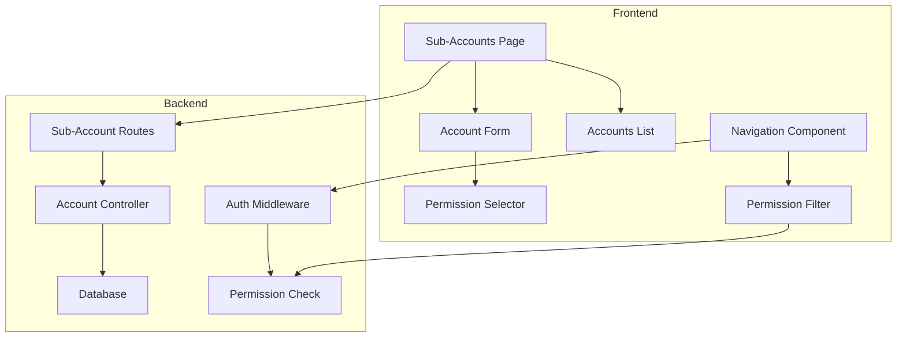

# Design Document: Admin Sub-Accounts

## Overview

The Admin Sub-Accounts system enables the primary administrator to create delegated accounts for employees with selective access to specific admin features. This allows fine-grained permission control where each sub-account can only access the admin methods explicitly granted to them.

The system integrates with the existing admin authentication flow and extends the navigation system to filter visible menu items based on permissions.

## Architecture



### System Flow

1. Primary admin creates sub-account with selected permissions
2. Sub-account credentials and permissions stored in database
3. Sub-account user logs in via admin login
4. System identifies user type and loads permissions
5. Navigation renders only permitted menu items
6. Route guards block unauthorized direct access

## Components and Interfaces

### Frontend Components

#### AdminSubAccounts.jsx
Main page component for managing sub-accounts.
- Displays list of existing sub-accounts
- Provides form for creating/editing accounts
- Handles permission selection UI

```typescript
interface SubAccountFormData {
  id?: number;
  name: string;
  email: string;
  username: string;
  password?: string;
  isActive: boolean;
  permissions: string[];
}
```

#### PermissionSelector.jsx
Reusable component for selecting admin permissions.
- Groups permissions by category
- Provides select all/none per category
- Visual indication of selected count

```typescript
interface PermissionSelectorProps {
  selectedPermissions: string[];
  onChange: (permissions: string[]) => void;
  disabled?: boolean;
}
```

### Backend API Endpoints

#### Sub-Account Management
- `GET /api/admin/sub-accounts` - List all sub-accounts
- `POST /api/admin/sub-accounts` - Create new sub-account
- `PUT /api/admin/sub-accounts/:id` - Update sub-account
- `DELETE /api/admin/sub-accounts/:id` - Delete sub-account
- `PATCH /api/admin/sub-accounts/:id/status` - Toggle account status

#### Authentication Extension
- `POST /api/admin/login` - Extended to handle sub-account login
- Returns user type and permissions in response

## Data Models

### Database Schema

```sql
CREATE TABLE admin_sub_accounts (
  id SERIAL PRIMARY KEY,
  name VARCHAR(255) NOT NULL,
  email VARCHAR(255) UNIQUE NOT NULL,
  username VARCHAR(100) UNIQUE NOT NULL,
  password_hash VARCHAR(255) NOT NULL,
  is_active BOOLEAN DEFAULT true,
  permissions JSON NOT NULL DEFAULT '[]',
  created_at TIMESTAMP DEFAULT CURRENT_TIMESTAMP,
  updated_at TIMESTAMP DEFAULT CURRENT_TIMESTAMP,
  last_login TIMESTAMP
);
```

### Permission Structure

```typescript
// Available admin permissions grouped by category
const ADMIN_PERMISSIONS = {
  registration: [
    { key: 'register_student', label: 'Register Student', path: '/create-register-student' },
    { key: 'register_staff', label: 'Register Staff', path: '/create-register-staff' },
  ],
  lists: [
    { key: 'list_students', label: 'View Students', path: '/list-student' },
    { key: 'list_staff', label: 'View Staff', path: '/list-staff' },
    { key: 'list_guardians', label: 'View Guardians', path: '/list-guardian' },
  ],
  academic: [
    { key: 'evaluation', label: 'Evaluation', path: '/evaluation' },
    { key: 'evaluation_book', label: 'Evaluation Book', path: '/evaluation-book' },
    { key: 'mark_list_view', label: 'Mark Lists', path: '/mark-list-view' },
    { key: 'attendance_view', label: 'Attendance', path: '/attendance-view' },
    { key: 'create_attendance', label: 'Create Attendance', path: '/create-attendance' },
    { key: 'create_mark_list', label: 'Create Mark List', path: '/create-mark-list' },
    { key: 'report_card', label: 'Report Card', path: '/report-card' },
    { key: 'schedule', label: 'Schedule', path: '/schedule' },
    { key: 'post', label: 'Posts', path: '/post' },
    { key: 'tasks', label: 'Tasks', path: '/tasks' },
  ],
  administration: [
    { key: 'communication', label: 'Communication', path: '/communication' },
    { key: 'class_teacher_assignment', label: 'Class Teachers', path: '/class-teacher-assignment' },
    { key: 'settings', label: 'Settings', path: '/settings' },
  ],
};

interface SubAccount {
  id: number;
  name: string;
  email: string;
  username: string;
  isActive: boolean;
  permissions: string[]; // Array of permission keys
  createdAt: Date;
  updatedAt: Date;
  lastLogin?: Date;
}
```

## Correctness Properties

*A property is a characteristic or behavior that should hold true across all valid executions of a system-essentially, a formal statement about what the system should do. Properties serve as the bridge between human-readable specifications and machine-verifiable correctness guarantees.*

### Property 1: Account Creation Persistence
*For any* valid sub-account data submitted, creating the account and then retrieving it should return the same name, email, username, and permissions.
**Validates: Requirements 1.2, 6.1**

### Property 2: Username and Email Uniqueness
*For any* existing sub-account, attempting to create another sub-account with the same username or email should result in a rejection error.
**Validates: Requirements 1.3**

### Property 3: Unique ID Generation
*For any* set of created sub-accounts, all account IDs should be distinct from each other.
**Validates: Requirements 1.4, 5.1**

### Property 4: Permission Update Consistency
*For any* existing sub-account and any new permission set, updating the permissions and then retrieving the account should return exactly the new permission set.
**Validates: Requirements 2.2, 2.3**

### Property 5: Account List Completeness
*For any* set of sub-accounts in the database, the list endpoint should return all accounts with their correct names, emails, and status.
**Validates: Requirements 3.1**

### Property 6: Status Toggle Correctness
*For any* sub-account, toggling its status should flip the isActive value from true to false or vice versa.
**Validates: Requirements 3.4**

### Property 7: Sub-Account Authentication
*For any* active sub-account with valid credentials, login should succeed and return the correct user type and permissions.
**Validates: Requirements 4.1**

### Property 8: Disabled Account Rejection
*For any* disabled sub-account, login attempts should fail with an account disabled error regardless of credential validity.
**Validates: Requirements 4.4**

### Property 9: Navigation Permission Filtering
*For any* sub-account with a specific permission set, the filtered navigation items should contain exactly the paths corresponding to those permissions.
**Validates: Requirements 4.2**

### Property 10: Route Access Control
*For any* sub-account and any route not in their permission set, access should be denied.
**Validates: Requirements 4.3**

### Property 11: Permission Count Accuracy
*For any* sub-account, the displayed permission count should equal the length of the permissions array.
**Validates: Requirements 5.2**

### Property 12: Search Filter Correctness
*For any* search query and set of sub-accounts, the returned results should only include accounts where the name or email contains the search term.
**Validates: Requirements 5.3**

### Property 13: JSON Serialization Round-Trip
*For any* valid sub-account object, serializing to JSON and then parsing back should produce an equivalent object.
**Validates: Requirements 6.3, 6.4**

## Error Handling

### Frontend Errors
- Form validation errors displayed inline
- API errors shown via toast notifications
- Network errors trigger retry prompts

### Backend Errors
- 400: Invalid input data (missing fields, invalid format)
- 401: Authentication failed
- 403: Insufficient permissions (sub-account trying to manage other sub-accounts)
- 409: Duplicate username or email
- 500: Server errors logged and generic message returned

### Error Response Format
```json
{
  "error": "Error message",
  "code": "ERROR_CODE",
  "details": {}
}
```

## Testing Strategy

### Unit Testing
- Test permission filtering logic
- Test form validation functions
- Test route guard logic
- Test search/filter functions

### Property-Based Testing
Property-based tests will use **fast-check** library for JavaScript/TypeScript to verify correctness properties.

Each property-based test MUST:
- Run a minimum of 100 iterations
- Be tagged with format: `**Feature: admin-sub-accounts, Property {number}: {property_text}**`
- Reference the correctness property from this design document

### Test Categories

1. **Account CRUD Properties** (Properties 1-6)
   - Generate random valid account data
   - Verify persistence and retrieval consistency
   - Test uniqueness constraints

2. **Authentication Properties** (Properties 7-8)
   - Generate accounts with various states
   - Verify login behavior matches account status

3. **Permission Enforcement Properties** (Properties 9-10)
   - Generate random permission sets
   - Verify navigation filtering
   - Verify route blocking

4. **Data Integrity Properties** (Properties 11-13)
   - Verify counts and aggregations
   - Test serialization round-trips
