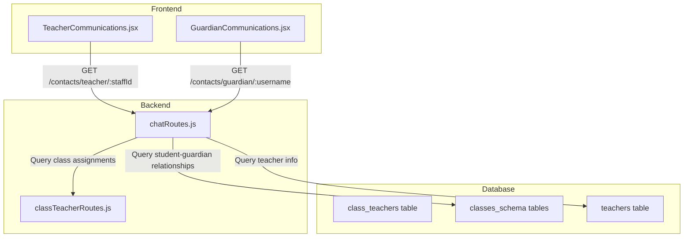

# Design Document: Class-Based Communication Filter

## Overview

This feature modifies the communication system to filter contacts based on class teaching relationships. The current implementation shows all contacts to all users, which creates noise and makes it difficult to find relevant contacts. The new implementation will:

1. Filter guardians for teachers based on their class assignments
2. Filter teachers for guardians based on their wards' class enrollments
3. Maintain full access for administrators

## Architecture

The solution involves modifications to both the backend API and frontend components:



## Components and Interfaces

### Backend API Changes

#### New Endpoint: GET /api/chats/contacts/teacher/:staffId

Returns filtered contacts for a teacher based on their class assignments.

**Request:**
- `staffId`: The global_staff_id of the teacher

**Response:**
```json
[
  {
    "id": "guardian_username",
    "name": "Guardian Name",
    "role": "guardian",
    "phone": "1234567890",
    "wardClass": "Class A"
  }
]
```

**Logic:**
1. Get classes taught by this teacher from `school_schema_points.class_teachers`
2. Get classes where teacher is assigned from schedule/subject mappings
3. Query `classes_schema` tables for guardians in those classes
4. Deduplicate and return

#### New Endpoint: GET /api/chats/contacts/guardian/:username

Returns filtered contacts for a guardian based on their wards' classes.

**Request:**
- `username`: The guardian's username

**Response:**
```json
[
  {
    "id": "staff_123",
    "name": "Teacher Name",
    "role": "teacher",
    "classes": ["Class A", "Class B"]
  },
  {
    "id": "1",
    "name": "Admin Director",
    "role": "director"
  }
]
```

**Logic:**
1. Get wards' classes from `classes_schema` tables
2. Get teachers assigned to those classes from `class_teachers` and schedule data
3. Always include directors/administrators
4. Deduplicate and return

### Frontend Changes

#### TeacherCommunications.jsx

- Pass `user.global_staff_id` to the new filtered contacts endpoint
- Update `fetchData` to use `/api/chats/contacts/teacher/${staffId}`

#### GuardianCommunications.jsx

- Pass guardian username to the new filtered contacts endpoint
- Update `fetchData` to use `/api/chats/contacts/guardian/${username}`

## Data Models

### Existing Tables Used

**school_schema_points.class_teachers**
```sql
- global_staff_id: INTEGER
- teacher_name: VARCHAR(100)
- assigned_class: VARCHAR(100)
- is_active: BOOLEAN
```

**classes_schema.[class_name]**
```sql
- school_id: VARCHAR
- class_id: VARCHAR
- student_name: VARCHAR
- guardian_name: VARCHAR
- guardian_username: VARCHAR
- guardian_phone: VARCHAR
```

**school_schema_points.teachers**
```sql
- global_staff_id: INTEGER
- teacher_name: VARCHAR
- role: VARCHAR
```

### Query Patterns

**Get guardians for a teacher:**
```sql
-- Get classes taught by teacher
SELECT assigned_class FROM school_schema_points.class_teachers 
WHERE global_staff_id = $1 AND is_active = true;

-- For each class, get guardians
SELECT DISTINCT guardian_name, guardian_username, guardian_phone 
FROM classes_schema."${className}"
WHERE guardian_name IS NOT NULL;
```

**Get teachers for a guardian:**
```sql
-- Get wards' classes
SELECT class FROM classes_schema tables 
WHERE guardian_username = $1;

-- Get teachers for those classes
SELECT DISTINCT ct.global_staff_id, ct.teacher_name 
FROM school_schema_points.class_teachers ct
WHERE ct.assigned_class IN (ward_classes) AND ct.is_active = true;

-- Always include directors
SELECT global_staff_id, teacher_name 
FROM school_schema_points.teachers 
WHERE role = 'Director';
```

## Correctness Properties

*A property is a characteristic or behavior that should hold true across all valid executions of a system-essentially, a formal statement about what the system should do. Properties serve as the bridge between human-readable specifications and machine-verifiable correctness guarantees.*

### Property 1: Teacher sees only relevant guardians
*For any* teacher with class assignments, all guardians returned by the contacts endpoint should have at least one ward in a class taught by that teacher.
**Validates: Requirements 1.1, 1.2**

### Property 2: No duplicate guardians for teachers
*For any* teacher with multiple class assignments, the contacts endpoint should return each guardian exactly once, regardless of how many wards they have in the teacher's classes.
**Validates: Requirements 1.3, 1.4**

### Property 3: Guardian sees only relevant teachers
*For any* guardian with wards, all non-director contacts returned by the contacts endpoint should teach at least one of the guardian's wards.
**Validates: Requirements 2.1**

### Property 4: Directors always visible to guardians
*For any* guardian, the contacts endpoint should always include all users with role 'director' in the result set.
**Validates: Requirements 2.2**

### Property 5: No duplicate teachers for guardians
*For any* guardian with multiple wards, the contacts endpoint should return each teacher exactly once, regardless of how many wards or subjects they teach.
**Validates: Requirements 2.3, 2.4**

### Property 6: Administrator sees all guardians
*For any* administrator/director, the contacts endpoint should return all guardians in the system.
**Validates: Requirements 3.1**

## Error Handling

| Error Condition | Handling |
|----------------|----------|
| Teacher has no class assignments | Return empty guardian list |
| Guardian has no wards | Return only directors |
| Invalid staffId/username | Return 404 with error message |
| Database connection failure | Return 500 with generic error |
| Class table doesn't exist | Skip that class, log warning |

## Testing Strategy

### Unit Tests
- Test filtering logic with mock data
- Test deduplication functions
- Test edge cases (no assignments, no wards)

### Property-Based Tests

The following properties will be tested using a property-based testing library (fast-check for JavaScript):

1. **Property 1 & 2**: Generate random teacher-class-guardian relationships, verify filtering and deduplication
2. **Property 3, 4 & 5**: Generate random guardian-ward-teacher relationships, verify filtering and deduplication
3. **Property 6**: Generate random admin users, verify they see all guardians

Each property-based test will:
- Run a minimum of 100 iterations
- Use generators to create realistic test data
- Be tagged with the property number it validates

### Integration Tests
- Test full API flow with real database
- Verify socket events work with filtered contacts
