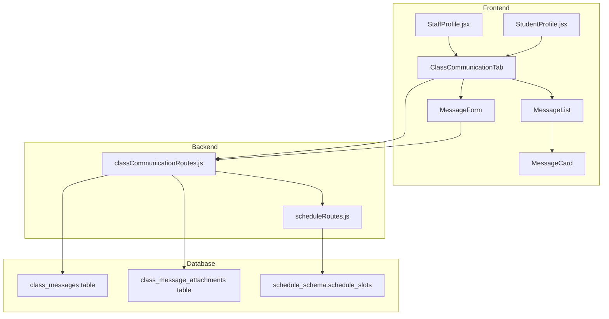

# Design Document: Class Communication

## Overview

The Class Communication feature provides a one-way messaging system between teachers and students within their assigned classes. Teachers can broadcast messages with optional file attachments to students in classes they teach, while students can view a combined feed of messages from all teachers who teach their class.

The system integrates with the existing schedule system to determine teacher-class relationships and leverages the existing mobile profile components for consistent UI/UX.

## Architecture



## Components and Interfaces

### Frontend Components

#### 1. ClassCommunicationTab (New Component)
Location: `APP/src/COMPONENTS/mobile/ClassCommunicationTab.jsx`

Props:
```typescript
interface ClassCommunicationTabProps {
  userType: 'teacher' | 'student';
  userId: string;           // global_staff_id or school_id
  userName: string;         // teacher name or student name
  userClass?: string;       // student's class (for students only)
  teachingClasses?: string[]; // classes teacher teaches (for teachers only)
}
```

State:
- `selectedClass`: Currently selected class (for teachers)
- `messages`: Array of messages for the current view
- `loading`: Loading state
- `error`: Error state

#### 2. MessageList (New Component)
Location: `APP/src/COMPONENTS/mobile/MessageList.jsx`

Props:
```typescript
interface MessageListProps {
  messages: Message[];
  loading: boolean;
  emptyMessage: string;
  showTeacherInfo: boolean;  // true for student view
}
```

#### 3. MessageForm (New Component)
Location: `APP/src/COMPONENTS/mobile/MessageForm.jsx`

Props:
```typescript
interface MessageFormProps {
  onSubmit: (message: string, attachments: File[]) => Promise<void>;
  disabled: boolean;
}
```

State:
- `message`: Text input value
- `attachments`: Array of selected files
- `sending`: Submission in progress

#### 4. MessageCard (New Component)
Location: `APP/src/COMPONENTS/mobile/MessageCard.jsx`

Props:
```typescript
interface MessageCardProps {
  message: Message;
  showTeacherInfo: boolean;
}
```

### Backend API Endpoints

#### 1. Get Teacher's Teaching Classes
```
GET /api/class-communication/teacher-classes/:teacherName
```
Response:
```json
{
  "classes": ["Class A", "Class B", "Class C"]
}
```

#### 2. Get Messages for a Class (Teacher View)
```
GET /api/class-communication/messages/:className
Query: ?teacherId=<global_staff_id>
```
Response:
```json
{
  "messages": [
    {
      "id": 1,
      "teacher_name": "John Doe",
      "teacher_id": "staff_123",
      "class_name": "Class A",
      "message": "Hello students...",
      "created_at": "2025-01-15T10:30:00Z",
      "attachments": [
        {
          "id": 1,
          "filename": "homework.pdf",
          "original_name": "Homework Assignment.pdf",
          "file_type": "application/pdf"
        }
      ]
    }
  ]
}
```

#### 3. Get Messages for Student's Class
```
GET /api/class-communication/student-messages/:className
```
Response: Same structure as teacher view, includes all teachers' messages

#### 4. Send Message
```
POST /api/class-communication/messages
Content-Type: multipart/form-data

Body:
- teacherId: string
- teacherName: string
- className: string
- message: string
- attachments: File[] (optional)
```
Response:
```json
{
  "success": true,
  "message": {
    "id": 1,
    "teacher_name": "John Doe",
    "class_name": "Class A",
    "message": "Hello students...",
    "created_at": "2025-01-15T10:30:00Z",
    "attachments": []
  }
}
```

#### 5. Download Attachment
```
GET /api/class-communication/attachments/:attachmentId
```
Response: File stream with appropriate content-type headers

## Data Models

### Database Schema

```sql
-- Table for class messages
CREATE TABLE class_messages (
    id SERIAL PRIMARY KEY,
    teacher_id VARCHAR(255) NOT NULL,
    teacher_name VARCHAR(255) NOT NULL,
    class_name VARCHAR(100) NOT NULL,
    message TEXT,
    created_at TIMESTAMP WITH TIME ZONE DEFAULT CURRENT_TIMESTAMP,
    updated_at TIMESTAMP WITH TIME ZONE DEFAULT CURRENT_TIMESTAMP
);

-- Index for efficient querying by class
CREATE INDEX idx_class_messages_class_name ON class_messages(class_name);
CREATE INDEX idx_class_messages_created_at ON class_messages(created_at);

-- Table for message attachments
CREATE TABLE class_message_attachments (
    id SERIAL PRIMARY KEY,
    message_id INTEGER REFERENCES class_messages(id) ON DELETE CASCADE,
    filename VARCHAR(255) NOT NULL,
    original_name VARCHAR(255) NOT NULL,
    file_type VARCHAR(100),
    file_size INTEGER,
    created_at TIMESTAMP WITH TIME ZONE DEFAULT CURRENT_TIMESTAMP
);

CREATE INDEX idx_attachments_message_id ON class_message_attachments(message_id);
```

### TypeScript Interfaces

```typescript
interface Message {
  id: number;
  teacher_id: string;
  teacher_name: string;
  class_name: string;
  message: string;
  created_at: string;
  attachments: Attachment[];
}

interface Attachment {
  id: number;
  filename: string;
  original_name: string;
  file_type: string;
  file_size?: number;
}

interface TeacherClassInfo {
  classes: string[];
}
```


## Correctness Properties

*A property is a characteristic or behavior that should hold true across all valid executions of a system-essentially, a formal statement about what the system should do. Properties serve as the bridge between human-readable specifications and machine-verifiable correctness guarantees.*

Based on the prework analysis, the following correctness properties have been identified:

### Property 1: Class Tab Visibility Matches Teaching Assignment Status
*For any* staff member, the "Class" navigation tab SHALL be visible if and only if the staff member has at least one teaching assignment in the schedule system.
**Validates: Requirements 1.1, 1.2**

### Property 2: Teacher Class List Matches Schedule Assignments
*For any* teacher with teaching assignments, the list of classes displayed in the Class tab SHALL exactly match the unique class names from the teacher's schedule assignments.
**Validates: Requirements 1.3**

### Property 3: Messages Are Sorted Chronologically
*For any* set of messages retrieved for a class, the messages SHALL be ordered by creation timestamp in ascending order (oldest first, newest last).
**Validates: Requirements 2.2, 7.2**

### Property 4: Message Display Contains Required Fields
*For any* message displayed in the teacher view, the rendered output SHALL contain the teacher name, message content, timestamp, and all associated attachments.
**Validates: Requirements 2.3**

### Property 5: Empty Message Validation
*For any* message submission attempt where the message text is empty or whitespace-only AND no attachments are provided, the system SHALL reject the submission.
**Validates: Requirements 3.2**

### Property 6: Message Creation Persists All Required Data
*For any* successfully created message, the stored record SHALL contain the teacher ID, teacher name, class name, message content, creation timestamp, and references to all uploaded attachments.
**Validates: Requirements 3.1, 7.1**

### Property 7: Attachment Storage and Display Consistency
*For any* message with N attachments submitted, after successful creation, retrieving that message SHALL return exactly N attachment records, each with filename, original name, and file type.
**Validates: Requirements 4.2, 4.3**

### Property 8: Student View Shows All Class Teachers' Messages
*For any* student in a given class, the Class tab SHALL display all messages from all teachers who have sent messages to that class, regardless of whether those teachers are currently assigned to teach the class.
**Validates: Requirements 5.2, 7.4**

### Property 9: Student Message Display Contains Required Fields
*For any* message displayed in the student view, the rendered output SHALL contain the teacher name, message content, timestamp, and all associated attachments.
**Validates: Requirements 5.3**

### Property 10: Attachment Rendering Matches File Type
*For any* attachment, if the file type is an image type (jpg, png, gif, webp), the system SHALL render a thumbnail preview; otherwise, the system SHALL render a file icon with the filename.
**Validates: Requirements 6.2, 6.3**

## Error Handling

### Frontend Error Handling

1. **Network Errors**: Display toast notification with retry option, preserve form state
2. **File Upload Errors**: Show specific error message, allow removing failed file and retrying
3. **Validation Errors**: Inline validation messages near the input field
4. **Loading States**: Skeleton loaders for message list, disabled submit button during send

### Backend Error Handling

1. **Database Errors**: Return 500 with generic error message, log detailed error
2. **File Storage Errors**: Return 500, clean up partial uploads
3. **Validation Errors**: Return 400 with specific field errors
4. **Authorization Errors**: Return 403 if teacher tries to post to class they don't teach

### Error Response Format
```json
{
  "error": "Error message for display",
  "code": "ERROR_CODE",
  "details": {} // Optional additional info
}
```

## Testing Strategy

### Unit Testing

Unit tests will cover:
- Message validation logic (empty message detection)
- File type detection for attachment rendering
- Date formatting utilities
- Class list extraction from schedule data

Testing Framework: Vitest (already used in the project)

### Property-Based Testing

Property-based tests will be implemented using `fast-check` library for JavaScript/TypeScript.

Each correctness property will have a corresponding property-based test that:
1. Generates random valid inputs
2. Executes the system under test
3. Verifies the property holds

Configuration:
- Minimum 100 iterations per property test
- Seed logging for reproducibility

Property tests will be tagged with format: `**Feature: class-communication, Property {number}: {property_text}**`

### Integration Testing

Integration tests will verify:
- API endpoint responses match expected schema
- File upload and retrieval works end-to-end
- Database constraints are enforced

### Test File Locations

- Unit tests: `APP/src/COMPONENTS/mobile/__tests__/`
- Property tests: `APP/src/COMPONENTS/mobile/__tests__/properties/`
- Backend tests: `backend/__tests__/classCommunication/`
