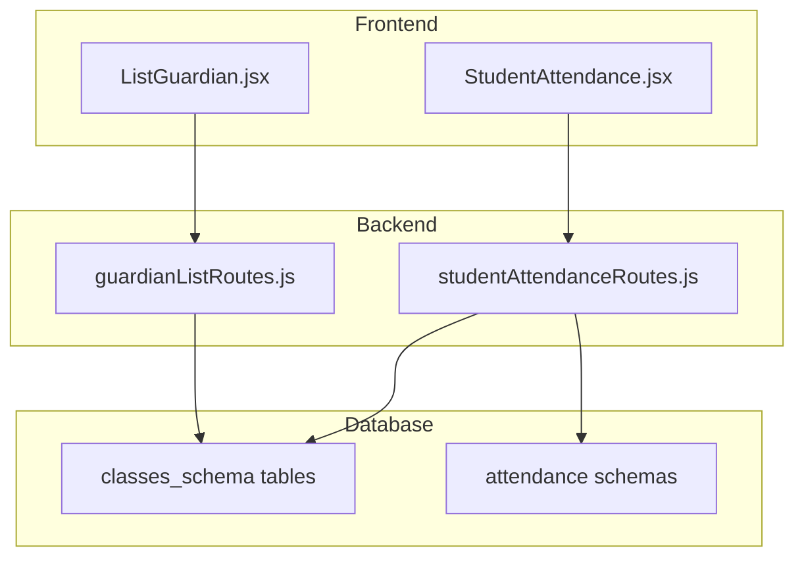

# Design Document: Guardians List & Student Attendance

## Overview

This design document outlines the implementation of two features for the school management system:
1. **Guardians List Page** - A directory page for viewing and managing guardian information
2. **Student Attendance Page** - A functional attendance management system for marking and tracking student attendance

Both features follow the existing application patterns using React with Framer Motion animations, CSS modules for styling, and axios for API communication.

## Architecture

### Frontend Architecture

```
APP/src/PAGE/
├── List/
│   └── ListGuardian/
│       ├── ListGuardian.jsx      # Main guardian list component
│       └── ListGuardian.module.css
└── StudentAttendance/
    ├── StudentAttendance.jsx      # Main attendance component
    └── StudentAttendance.module.css
```

### Backend Architecture

```
backend/routes/
├── guardianListRoutes.js          # Guardian list API endpoints
└── studentAttendanceRoutes.js     # Student attendance API endpoints (new)
```

### Data Flow



## Components and Interfaces

### ListGuardian Component

```typescript
interface Guardian {
  id: string;
  guardian_name: string;
  guardian_phone: string;
  guardian_email?: string;
  guardian_username?: string;
  guardian_password?: string;
  image_guardian?: string;
  students: StudentReference[];
}

interface StudentReference {
  student_name: string;
  class: string;
  school_id: string;
}

interface ListGuardianProps {
  // No props - uses internal state
}

// Component State
interface ListGuardianState {
  guardians: Guardian[];
  filteredGuardians: Guardian[];
  loading: boolean;
  searchTerm: string;
  viewMode: 'grid' | 'list';
  selectedGuardian: Guardian | null;
  showModal: boolean;
  currentPage: number;
}
```

### StudentAttendance Component

```typescript
interface AttendanceRecord {
  id: string;
  student_id: string;
  student_name: string;
  class_id: string;
  date: string;
  status: 'present' | 'absent' | 'late';
  marked_by: string;
  marked_at: string;
  notes?: string;
}

interface StudentAttendanceProps {
  // No props - uses internal state
}

interface StudentAttendanceState {
  classes: string[];
  selectedClass: string;
  selectedDate: string;
  students: Student[];
  attendanceRecords: AttendanceRecord[];
  loading: boolean;
  viewMode: 'mark' | 'history';
  filters: AttendanceFilters;
}

interface AttendanceFilters {
  dateFrom: string;
  dateTo: string;
  status: string;
  studentSearch: string;
}
```

### API Interfaces

```typescript
// Guardian List API
GET /api/guardian-list/guardians
Response: Guardian[]

GET /api/guardian-list/guardian/:guardianId/students
Response: StudentReference[]

// Student Attendance API
GET /api/student-attendance/classes
Response: string[]

GET /api/student-attendance/students/:className
Response: Student[]

GET /api/student-attendance/records/:className/:date
Response: AttendanceRecord[]

POST /api/student-attendance/mark
Body: { className: string, date: string, records: AttendanceRecord[] }
Response: { success: boolean, message: string }

GET /api/student-attendance/history
Query: { className?, dateFrom?, dateTo?, status? }
Response: AttendanceRecord[]

GET /api/student-attendance/export
Query: { className, dateFrom, dateTo, format: 'csv' }
Response: CSV file download
```

## Data Models

### Guardian Data (from existing classes_schema tables)

Guardians are extracted from student records in the classes_schema tables. Each student record contains guardian information:
- `guardian_name`
- `guardian_phone`
- `guardian_email`
- `guardian_username`
- `guardian_password`

### Attendance Data Model

```sql
-- New table in each class attendance schema
CREATE TABLE student_daily_attendance (
  id SERIAL PRIMARY KEY,
  school_id VARCHAR(50) NOT NULL,
  class_id VARCHAR(50) NOT NULL,
  student_name VARCHAR(100) NOT NULL,
  attendance_date DATE NOT NULL,
  status VARCHAR(10) NOT NULL CHECK (status IN ('present', 'absent', 'late')),
  marked_by VARCHAR(100),
  marked_at TIMESTAMP DEFAULT CURRENT_TIMESTAMP,
  notes TEXT,
  CONSTRAINT unique_daily_attendance UNIQUE (school_id, class_id, attendance_date)
);

CREATE INDEX idx_attendance_date ON student_daily_attendance(attendance_date);
CREATE INDEX idx_attendance_status ON student_daily_attendance(status);
```

## Correctness Properties

*A property is a characteristic or behavior that should hold true across all valid executions of a system-essentially, a formal statement about what the system should do. Properties serve as the bridge between human-readable specifications and machine-verifiable correctness guarantees.*

### Property 1: Guardian statistics accuracy
*For any* list of guardians displayed, the total count shown in statistics SHALL equal the actual number of unique guardians in the filtered list.
**Validates: Requirements 1.3**

### Property 2: Search filter correctness
*For any* search term and guardian list, all returned guardians SHALL contain the search term in at least one of: name, phone number, or email (case-insensitive).
**Validates: Requirements 2.1**

### Property 3: Pagination consistency
*For any* guardian list exceeding the page size, the sum of items across all pages SHALL equal the total filtered count.
**Validates: Requirements 2.3**

### Property 4: Guardian-student association completeness
*For any* guardian detail view, all students associated with that guardian (by guardian_name or guardian_phone match) SHALL be displayed.
**Validates: Requirements 3.2**

### Property 5: Class student list completeness
*For any* selected class, the attendance marking view SHALL display exactly all students registered in that class.
**Validates: Requirements 4.1**

### Property 6: Attendance marking round-trip
*For any* attendance record marked and saved, retrieving attendance for that student and date SHALL return the same status that was saved.
**Validates: Requirements 4.2**

### Property 7: Attendance uniqueness invariant
*For any* student and date combination, there SHALL exist at most one attendance record in the database.
**Validates: Requirements 4.3**

### Property 8: Date range filter correctness
*For any* date range filter applied, all returned attendance records SHALL have dates within the specified range (inclusive).
**Validates: Requirements 5.1**

### Property 9: Multi-filter conjunction
*For any* combination of filters (class, student, status), all returned records SHALL satisfy ALL applied filter conditions.
**Validates: Requirements 5.2**

### Property 10: Statistics calculation accuracy
*For any* attendance dataset, the sum of present, absent, and late percentages SHALL equal 100% (within rounding tolerance), and each percentage SHALL match the actual count ratio.
**Validates: Requirements 5.3**

### Property 11: CSV export completeness
*For any* exported CSV, the number of data rows SHALL equal the number of displayed attendance records, and each row SHALL contain all required fields.
**Validates: Requirements 5.4**

### Property 12: Attendance record data integrity
*For any* created attendance record, the record SHALL contain valid non-null values for: student_id, class_id, date, status, and timestamp.
**Validates: Requirements 6.1**

### Property 13: Attendance sorting order
*For any* retrieved attendance history, records SHALL be sorted by date in descending order (most recent first).
**Validates: Requirements 6.2**

## Error Handling

### Frontend Error Handling

1. **Network Errors**: Display toast notification with retry option
2. **Empty States**: Show informative empty state with guidance
3. **Loading States**: Display skeleton loaders during data fetch
4. **Validation Errors**: Inline field validation with error messages

### Backend Error Handling

1. **Database Errors**: Return 500 with sanitized error message
2. **Validation Errors**: Return 400 with specific field errors
3. **Not Found**: Return 404 with descriptive message
4. **Duplicate Entry**: Return 409 for attendance conflicts

## Testing Strategy

### Dual Testing Approach

This feature uses both unit tests and property-based tests for comprehensive coverage:
- **Unit tests** verify specific examples, edge cases, and integration points
- **Property-based tests** verify universal properties that should hold across all inputs

### Property-Based Testing

**Library**: fast-check (JavaScript property-based testing library)

**Configuration**: Each property test runs minimum 100 iterations.

**Test File Location**: `APP/src/PAGE/List/ListGuardian/__tests__/ListGuardian.property.test.js` and `APP/src/PAGE/StudentAttendance/__tests__/StudentAttendance.property.test.js`

**Annotation Format**: Each property test is tagged with:
```javascript
// **Feature: guardians-attendance, Property {number}: {property_text}**
```

### Unit Testing

**Library**: Vitest with React Testing Library

**Coverage Areas**:
- Component rendering with various data states
- User interaction handlers (click, search, filter)
- API integration mocking
- Edge cases (empty data, single item, max pagination)

### Test Organization

```
APP/src/PAGE/
├── List/ListGuardian/
│   └── __tests__/
│       ├── ListGuardian.test.jsx           # Unit tests
│       └── ListGuardian.property.test.js   # Property tests
└── StudentAttendance/
    └── __tests__/
        ├── StudentAttendance.test.jsx      # Unit tests
        └── StudentAttendance.property.test.js  # Property tests
```
