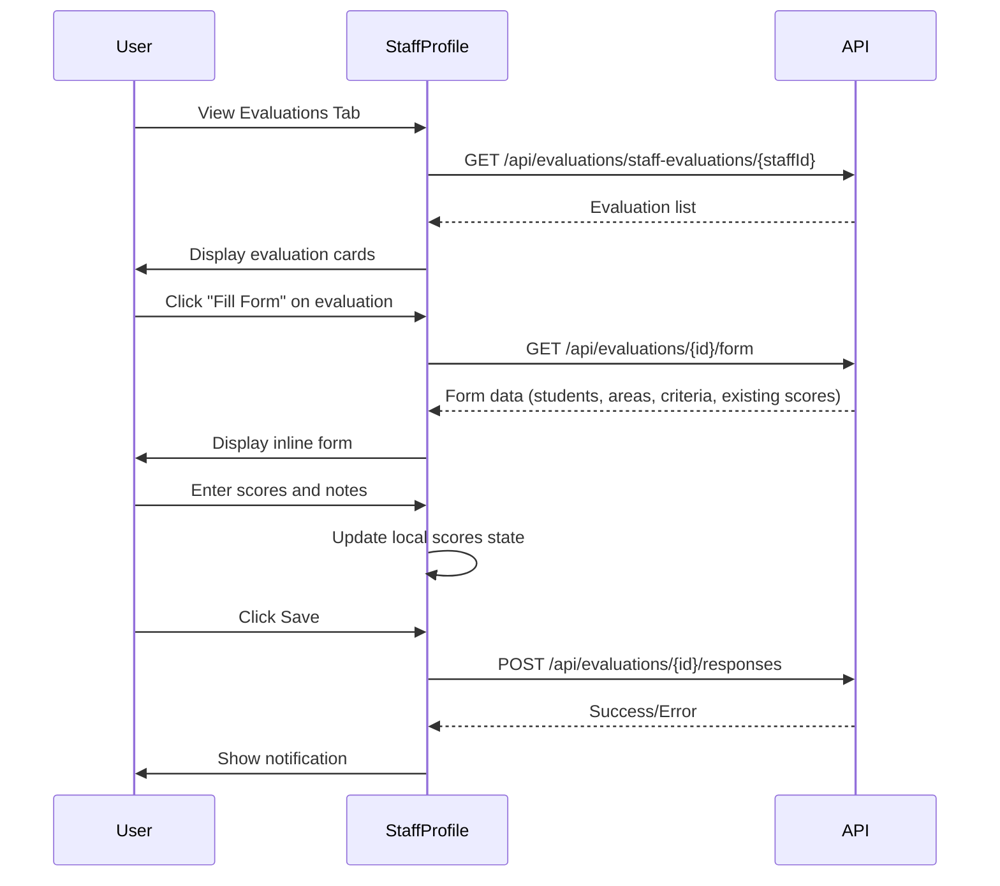

# Design Document: Staff Profile Inline Evaluations

## Overview

This feature extends the existing Staff Profile component to support inline evaluation form functionality. Staff members will be able to view their assigned evaluations and complete evaluation forms directly within the Evaluations tab, eliminating the need to navigate to a separate page. The implementation reuses existing API endpoints and adapts the evaluation form UI for the mobile-optimized profile layout.

## Architecture

The feature follows the existing React component architecture of the Staff Profile page:

```
StaffProfile.jsx
├── Evaluations Tab (enhanced)
│   ├── Evaluation List View (existing, enhanced)
│   │   └── Evaluation Cards with action buttons
│   └── Inline Evaluation Form View (new)
│       ├── Form Header with back navigation
│       ├── Student List with score inputs
│       └── Save/Submit actions
```

### State Management

The component uses React's useState for local state management:
- `evaluationView`: Controls whether showing 'list' or 'form' view
- `selectedEvaluation`: The evaluation being edited
- `evaluationFormData`: Form data including students, areas, and criteria
- `scores`: Object mapping student names to criterion scores and notes

### Data Flow



## Components and Interfaces

### Enhanced Evaluations Tab State

```javascript
// New state variables in StaffProfile
const [evaluationView, setEvaluationView] = useState('list'); // 'list' | 'form'
const [selectedEvaluationId, setSelectedEvaluationId] = useState(null);
const [evaluationFormData, setEvaluationFormData] = useState(null);
const [formStudents, setFormStudents] = useState([]);
const [scores, setScores] = useState({});
const [formLoading, setFormLoading] = useState(false);
const [formSaving, setFormSaving] = useState(false);
```

### Key Functions

```javascript
// Fetch evaluation form data
const fetchEvaluationForm = async (evaluationId) => {
  // GET /api/evaluations/{evaluationId}/form
  // Returns: { evaluation, areas, students }
};

// Update score for a student/criterion
const updateScore = (studentName, criterionId, field, value) => {
  // Updates scores state
};

// Calculate total score for a student
const calculateStudentTotal = (studentName) => {
  // Sums all criterion scores for the student
};

// Save all scores
const saveEvaluationScores = async () => {
  // POST /api/evaluations/{evaluationId}/responses
};

// Navigate back to list
const handleBackToList = () => {
  setEvaluationView('list');
  setSelectedEvaluationId(null);
  fetchStaffEvaluations(profile.global_staff_id); // Refresh list
};
```

### API Endpoints Used

| Endpoint | Method | Purpose |
|----------|--------|---------|
| `/api/evaluations/staff-evaluations/{staffId}` | GET | Fetch evaluations assigned to staff |
| `/api/evaluations/{id}/form` | GET | Fetch form structure with students and existing scores |
| `/api/evaluations/{id}/responses` | POST | Submit evaluation scores |

## Data Models

### Evaluation List Item (existing)
```typescript
interface EvaluationListItem {
  id: number;
  evaluation_name: string;
  subject_name: string;
  class_name: string;
  term: string;
  status: 'pending' | 'in_progress' | 'completed';
}
```

### Evaluation Form Data (from API)
```typescript
interface EvaluationFormData {
  evaluation: {
    id: number;
    evaluation_name: string;
    subject_name: string;
    class_name: string;
    term: string;
    staff_name: string;
  };
  areas: EvaluationArea[];
  students: Student[];
}

interface EvaluationArea {
  id: number;
  area_name: string;
  criteria: Criterion[];
}

interface Criterion {
  id: number;
  criteria_name: string;
  max_points: number;
}

interface Student {
  student_name: string;
  student_age: number;
  student_gender: string;
  scores?: Record<number, { score: number; notes: string }>;
}
```

### Scores State Structure
```typescript
interface ScoresState {
  [studentName: string]: {
    [criterionId: number]: {
      score: number;
      notes: string;
    };
  };
}
```

## Correctness Properties

*A property is a characteristic or behavior that should hold true across all valid executions of a system-essentially, a formal statement about what the system should do. Properties serve as the bridge between human-readable specifications and machine-verifiable correctness guarantees.*

### Property 1: Evaluation list displays all assigned evaluations with required fields
*For any* staff member ID and set of assigned evaluations, the rendered evaluation list should contain all evaluations for that staff member, and each evaluation card should display the evaluation name, subject, class, term, and status.
**Validates: Requirements 1.1, 1.2**

### Property 2: Status-based visual distinction
*For any* evaluation with status "pending" or "in_progress", the evaluation card should have a different CSS class than evaluations with status "completed".
**Validates: Requirements 1.3**

### Property 3: Form displays all students and criteria
*For any* evaluation form data containing students and evaluation areas with criteria, the inline form should render all students and all criteria grouped by their respective areas.
**Validates: Requirements 2.1, 2.2, 2.3**

### Property 4: Score input validation
*For any* criterion with a defined max_points value, the score input should only accept integer values from 0 to max_points inclusive.
**Validates: Requirements 2.4**

### Property 5: Score calculation correctness
*For any* student with scores entered across multiple criteria, the displayed total score should equal the sum of all individual criterion scores, and should be shown relative to the maximum possible points.
**Validates: Requirements 5.1, 5.2, 5.3**

### Property 6: Save payload structure
*For any* set of entered scores and notes, the save operation should submit a payload containing all students with their scores mapped by criterion name.
**Validates: Requirements 3.1**

### Property 7: Navigation state consistency
*For any* navigation from form view to list view, the evaluation list should be refreshed to reflect current data.
**Validates: Requirements 4.2, 4.3**

## Error Handling

| Error Scenario | Handling |
|----------------|----------|
| Form fetch fails | Display error message, show retry option |
| Save fails | Display error toast with message, keep form data intact |
| Network timeout | Show timeout error, allow retry |
| Invalid score input | Prevent input, show validation feedback |

### Error States

```javascript
// Form loading error
if (formError) {
  return (
    <div className={styles.errorState}>
      <FiAlertCircle />
      <p>{formError}</p>
      <button onClick={handleBackToList}>Back to List</button>
    </div>
  );
}
```

## Testing Strategy

### Unit Tests
- Test `calculateStudentTotal` function with various score combinations
- Test `updateScore` function updates state correctly
- Test score validation logic for boundary values

### Property-Based Tests
The following properties will be tested using fast-check library:

1. **Property 1**: Generate random evaluation lists and verify all items are rendered with required fields
2. **Property 4**: Generate random max_points values and verify score validation accepts only valid range
3. **Property 5**: Generate random scores across criteria and verify total calculation
4. **Property 6**: Generate random score states and verify payload structure

### Integration Tests
- Test form fetch and display flow
- Test save operation with mock API
- Test navigation between list and form views

### Test Configuration
- Property-based tests will run minimum 100 iterations
- Tests will use fast-check for property-based testing
- Each property test will be tagged with format: `**Feature: staff-profile-evaluations, Property {number}: {property_text}**`

