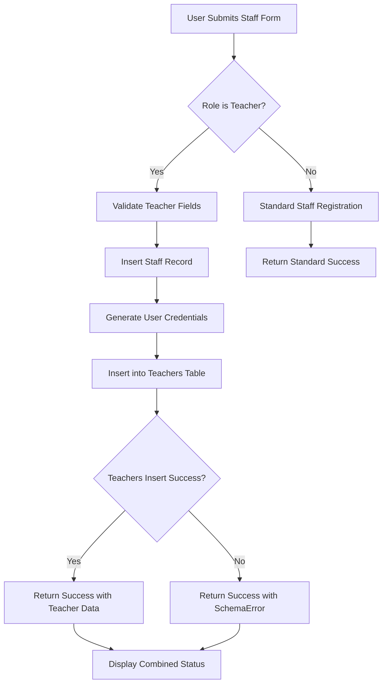

# Design Document: Staff Teachers Registration Fix

## Overview

This design addresses issues in the staff registration flow when adding staff members with the "Teacher" role. The fix ensures proper data flow between the staff registration form and the `school_schema_points.teachers` table, with improved error handling, validation, and user feedback.

## Architecture

The staff-to-teachers registration follows a multi-step process:



## Components and Interfaces

### Frontend Components

#### StaffForm.jsx (Modified)
- Add teacher-specific validation when role is "Teacher"
- Display separate status indicators for staff and teacher table operations
- Show teacher data in success response
- Handle schoolSchemaError display

#### CreateRegisterStaff.jsx (Modified)
- Update handleFormSuccess to handle teacher-specific feedback
- Add teacher status indicator in the success message

### Backend API

#### POST /api/staff/add-staff
**Request:** FormData with staff fields including role, name, staff_work_time
**Response:**
```typescript
interface AddStaffResponse {
  message: string;
  userCredentials?: {
    username: string;
    password: string;
    message: string;
  };
  schoolSchemaError?: string;
  scheduleError?: string;
  teacherData?: {
    name: string;
    workTime: string;
    globalStaffId: string;
  };
}
```

### Validation Rules

| Field | Condition | Validation |
|-------|-----------|------------|
| name | role === 'Teacher' | Required, non-empty |
| staff_work_time | role === 'Teacher' | Required, must be 'Full Time' or 'Part Time' |
| schedule | role === 'Teacher' && staff_work_time === 'Part Time' | Required schedule data |

## Data Models

### school_schema_points.teachers Table
```sql
CREATE TABLE school_schema_points.teachers (
  id SERIAL PRIMARY KEY,
  global_staff_id VARCHAR(50) UNIQUE NOT NULL,
  teacher_name VARCHAR(100) NOT NULL,
  staff_work_time VARCHAR(20) DEFAULT 'Full Time',
  role VARCHAR(50) DEFAULT 'Teacher',
  staff_enrollment_type VARCHAR(20) DEFAULT 'Permanent',
  created_at TIMESTAMP DEFAULT CURRENT_TIMESTAMP,
  updated_at TIMESTAMP DEFAULT CURRENT_TIMESTAMP
);
```

### Form State Interface
```typescript
interface TeacherFormState {
  name: string;
  role: string;
  staff_work_time: 'Full Time' | 'Part Time';
  staff_enrollment_type: 'Permanent' | 'Contract';
  // Part-time specific fields
  work_days?: string[];
  shifts?: string[];
  availability?: AvailabilitySlot[];
  max_hours_per_day?: number;
  max_hours_per_week?: number;
}
```

## Correctness Properties

*A property is a characteristic or behavior that should hold true across all valid executions of a system-essentially, a formal statement about what the system should do. Properties serve as the bridge between human-readable specifications and machine-verifiable correctness guarantees.*

### Property 1: Teacher Registration Dual Insert
*For any* valid staff registration with role "Teacher", submitting the form SHALL result in records being created in both the staff table and the school_schema_points.teachers table with matching global_staff_id.
**Validates: Requirements 1.1, 1.4**

### Property 2: Teacher Data Completeness
*For any* teacher record created in school_schema_points.teachers, the record SHALL contain non-null values for global_staff_id, teacher_name, staff_work_time, role, and staff_enrollment_type.
**Validates: Requirements 1.4**

### Property 3: Teacher Success Feedback
*For any* successful teacher addition (where teacherData is present in response), the UI SHALL display a success indicator and the teacher's name, work time, and global staff ID.
**Validates: Requirements 1.2, 2.2, 4.1**

### Property 4: Teacher Error Isolation
*For any* teacher table insertion failure, the staff record SHALL remain in the primary table, and the schoolSchemaError SHALL be returned without blocking the overall registration success.
**Validates: Requirements 1.3, 2.3, 4.2**

### Property 5: Teacher Field Validation
*For any* form state where role is "Teacher", the form SHALL require name and staff_work_time fields to be filled before allowing submission.
**Validates: Requirements 3.1, 3.2, 3.4**

### Property 6: Part-Time Schedule Validation
*For any* form state where role is "Teacher" and staff_work_time is "Part Time", the form SHALL require schedule information (work_days, shifts) before allowing submission.
**Validates: Requirements 3.3**

### Property 7: Registration Status Summary
*For any* completed registration, the UI SHALL display separate status indicators for staff registration success and teacher table addition status (success or error).
**Validates: Requirements 2.4, 4.4**

### Property 8: Credential Display
*For any* registration response containing userCredentials, the UI SHALL display the username and password in a clearly visible credentials section.
**Validates: Requirements 4.3**

## Error Handling

| Error Type | Handling Strategy | User Feedback |
|------------|-------------------|---------------|
| Teachers table insert failure | Log error, continue with staff registration | Display schoolSchemaError message |
| Validation failure | Prevent submission | Highlight missing fields |
| Network error | Catch and display | Show error message with retry option |
| Schedule system error | Log error, continue | Display scheduleError message |

## Testing Strategy

### Unit Testing
- Test teacher field validation logic
- Test form state management for teacher-specific fields
- Test response handling for different scenarios (success, partial success, error)

### Property-Based Testing
Using a property-based testing library (e.g., fast-check for JavaScript), we will verify:

1. **Property 1 (Dual Insert)**: Generate random valid teacher data, submit, verify both tables have records
2. **Property 2 (Data Completeness)**: Generate random teacher records, verify all required fields are non-null
3. **Property 3 (Success Feedback)**: Generate responses with teacherData, verify UI displays correct information
4. **Property 4 (Error Isolation)**: Simulate teacher table failures, verify staff record persists
5. **Property 5 (Field Validation)**: Generate form states with role "Teacher", verify validation rules
6. **Property 6 (Part-Time Validation)**: Generate part-time teacher forms, verify schedule requirement
7. **Property 7 (Status Summary)**: Generate various response types, verify status display
8. **Property 8 (Credential Display)**: Generate responses with credentials, verify display

Each property-based test will be configured to run a minimum of 100 iterations and will be tagged with the format: `**Feature: staff-teachers-registration, Property {number}: {property_text}**`
