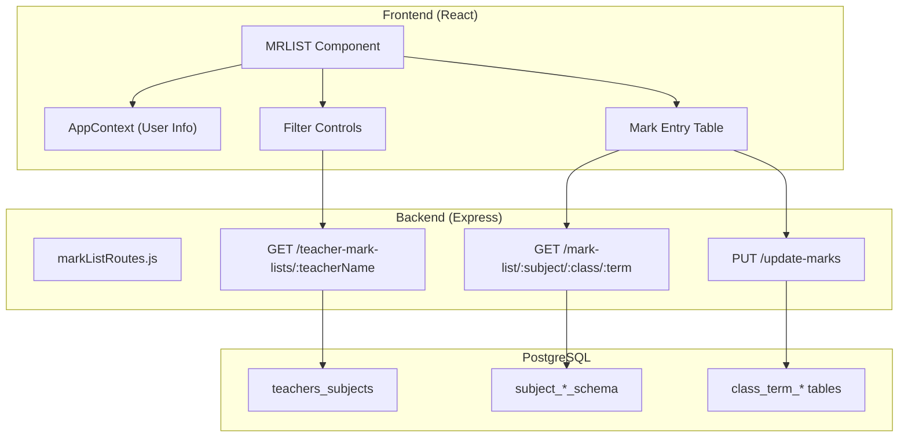

# Design Document: Teacher Mark List Display

## Overview

This feature transforms the existing static MRLIST component in the Staff portal into a dynamic, data-driven interface that displays only the mark list forms assigned to the logged-in teacher. The system integrates with the existing teacher-subject assignment infrastructure to filter and display relevant mark lists, enabling teachers to efficiently enter and manage student marks.

## Architecture

The feature follows the existing React + Express architecture with PostgreSQL database:



## Components and Interfaces

### Frontend Components

#### MRLIST Component (Refactored)
Location: `APP/src/Staff/MRLIST/MRLIST.jsx`

```typescript
interface TeacherAssignment {
  subjectName: string;
  className: string;
  termNumber: number;
  subjectClass: string;
  formId: string;
}

interface MarkListStudent {
  id: number;
  student_name: string;
  age: number;
  gender: string;
  [componentKey: string]: number | string; // Dynamic mark components
  total: number;
  pass_status: string;
}

interface FormConfig {
  mark_components: Array<{
    name: string;
    percentage: number;
  }>;
  pass_threshold: number;
}

interface MRLISTState {
  assignments: TeacherAssignment[];
  selectedSubject: string;
  selectedClass: string;
  selectedTerm: number;
  markList: MarkListStudent[];
  formConfig: FormConfig | null;
  loading: boolean;
  message: string;
}
```

### API Endpoints

#### GET /api/mark-list/teacher-mark-lists/:teacherName
Returns all mark list forms assigned to a teacher.

Response:
```json
{
  "teacherName": "John Smith",
  "assignments": [
    {
      "subjectName": "Mathematics",
      "className": "9A",
      "termNumber": 1,
      "subjectClass": "Mathematics Class 9A",
      "formId": "Mathematics_9A_1"
    }
  ]
}
```

#### GET /api/mark-list/mark-list/:subjectName/:className/:termNumber
Returns the mark list data for a specific subject-class-term combination.

Response:
```json
{
  "markList": [...],
  "config": {
    "mark_components": [...],
    "pass_threshold": 50
  }
}
```

#### PUT /api/mark-list/update-marks
Updates marks for a specific student.

Request:
```json
{
  "subjectName": "Mathematics",
  "className": "9A",
  "termNumber": 1,
  "studentId": 123,
  "marks": {
    "test_1": 18,
    "quiz": 8,
    "final": 35
  }
}
```

## Data Models

### Database Tables (Existing)

#### teachers_subjects
```sql
CREATE TABLE subjects_of_school_schema.teachers_subjects (
  id SERIAL PRIMARY KEY,
  teacher_name VARCHAR(255) NOT NULL,
  subject_class VARCHAR(255) NOT NULL,
  created_at TIMESTAMP DEFAULT CURRENT_TIMESTAMP
);
```

#### Mark List Tables (Dynamic per subject)
```sql
-- Example: subject_mathematics_schema.9a_term_1
CREATE TABLE subject_mathematics_schema.9a_term_1 (
  id SERIAL PRIMARY KEY,
  student_name VARCHAR(255),
  age INTEGER,
  gender VARCHAR(10),
  test_1 DECIMAL(5,2) DEFAULT 0,
  quiz DECIMAL(5,2) DEFAULT 0,
  final DECIMAL(5,2) DEFAULT 0,
  total DECIMAL(5,2) DEFAULT 0,
  pass_status VARCHAR(10) DEFAULT 'Fail'
);
```

## Correctness Properties

*A property is a characteristic or behavior that should hold true across all valid executions of a system-essentially, a formal statement about what the system should do. Properties serve as the bridge between human-readable specifications and machine-verifiable correctness guarantees.*

### Property 1: Assignment Filtering
*For any* teacher with assignments in the database, the list of assignments returned by the API should contain exactly the subject-class combinations stored in the teachers_subjects table for that teacher, with no additional or missing entries.
**Validates: Requirements 1.1, 2.1**

### Property 2: Assignment Display Completeness
*For any* teacher assignment, the displayed information should contain the subject name, class name, and all available terms that have mark list forms created.
**Validates: Requirements 1.3**

### Property 3: Cascading Class Filter
*For any* teacher and selected subject, the class dropdown should contain exactly the classes that are assigned to that teacher for that specific subject.
**Validates: Requirements 2.2**

### Property 4: Cascading Term Filter
*For any* subject-class combination, the term dropdown should contain exactly the terms for which mark list forms exist in the database.
**Validates: Requirements 2.3**

### Property 5: Mark List Data Integrity
*For any* loaded mark list, the displayed students and their marks should exactly match the data stored in the corresponding database table.
**Validates: Requirements 1.4, 3.1**

### Property 6: Mark Validation Range
*For any* mark component with percentage weight P, the system should accept values in the range [0, P] and reject values outside this range.
**Validates: Requirements 3.2**

### Property 7: Mark Save Round-Trip
*For any* valid marks entered and saved for a student, reading the marks back from the database should return the same values that were saved.
**Validates: Requirements 3.3**

### Property 8: Total Calculation
*For any* set of marks and their corresponding component weights, the calculated total should equal the sum of all entered marks.
**Validates: Requirements 4.2**

### Property 9: Pass/Fail Status Determination
*For any* calculated total T and pass threshold TH, the status should be "Pass" if T >= TH, otherwise "Fail".
**Validates: Requirements 4.3**

### Property 10: Progress Calculation
*For any* mark list, the progress percentage should equal (number of students with all marks entered / total students) * 100.
**Validates: Requirements 5.1, 5.2**

## Error Handling

| Error Scenario | Handling Strategy |
|----------------|-------------------|
| No assignments for teacher | Display informative message with empty state UI |
| API fetch failure | Show error toast, retain current state, allow retry |
| Mark validation failure | Highlight invalid input, show validation message |
| Save operation failure | Show error message, retain entered data in form |
| Network timeout | Show timeout message, enable retry button |
| Invalid mark list form | Display error, suggest contacting administrator |

## Testing Strategy

### Dual Testing Approach

This feature requires both unit tests and property-based tests to ensure comprehensive coverage.

### Unit Tests
- Test component rendering with mock data
- Test filter state management
- Test API error handling
- Test loading states and transitions
- Test empty state display

### Property-Based Testing

**Library**: fast-check (JavaScript property-based testing library)

**Configuration**: Each property test will run a minimum of 100 iterations.

**Test Annotation Format**: Each property-based test must be tagged with:
`**Feature: teacher-marklist-display, Property {number}: {property_text}**`

**Properties to Test**:
1. Assignment filtering returns exact matches
2. Cascading filters produce correct subsets
3. Mark validation accepts/rejects correct ranges
4. Total calculation is mathematically correct
5. Pass/fail status follows threshold rule
6. Progress calculation is accurate

### Test File Structure
```
APP/src/Staff/MRLIST/
├── MRLIST.jsx
├── MRLIST.module.css
├── MRLIST.test.jsx          # Unit tests
└── MRLIST.property.test.js  # Property-based tests
```
